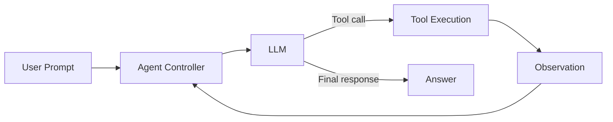
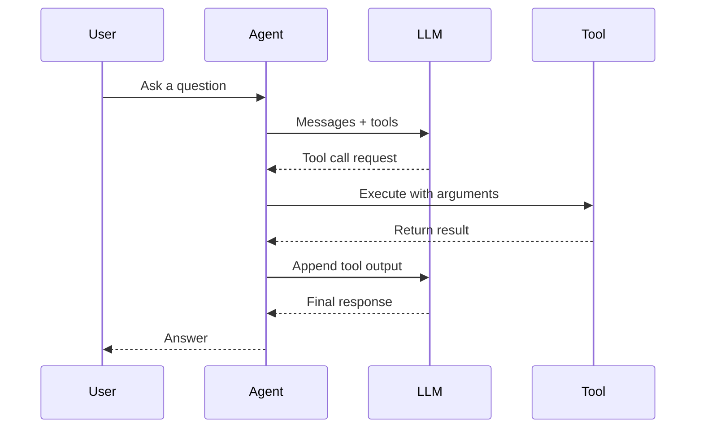

# Agents

This folder contains notebooks and examples focused on building autonomous AI agents. The goal is to demonstrate the core mechanics of agentic workflows without heavy frameworks: tool definitions, tool calling, and iterative reasoning loops.

## What You Will Find Here

- Minimal, from-scratch agent implementations
- Tool schema design (manual JSON schema and Pydantic)
- Examples of tool invocation and response handling
- End-to-end demos with a lightweight agent loop

## Folder Overview

- [agents_from_scratch](agents_from_scratch) — A full notebook walkthrough of building an agent loop with tool-calling.

## Agent Flow (Mermaid)

## Notes

- Each example emphasizes clarity and minimal dependencies.
- The workflows are designed to be framework-agnostic and easy to extend.

