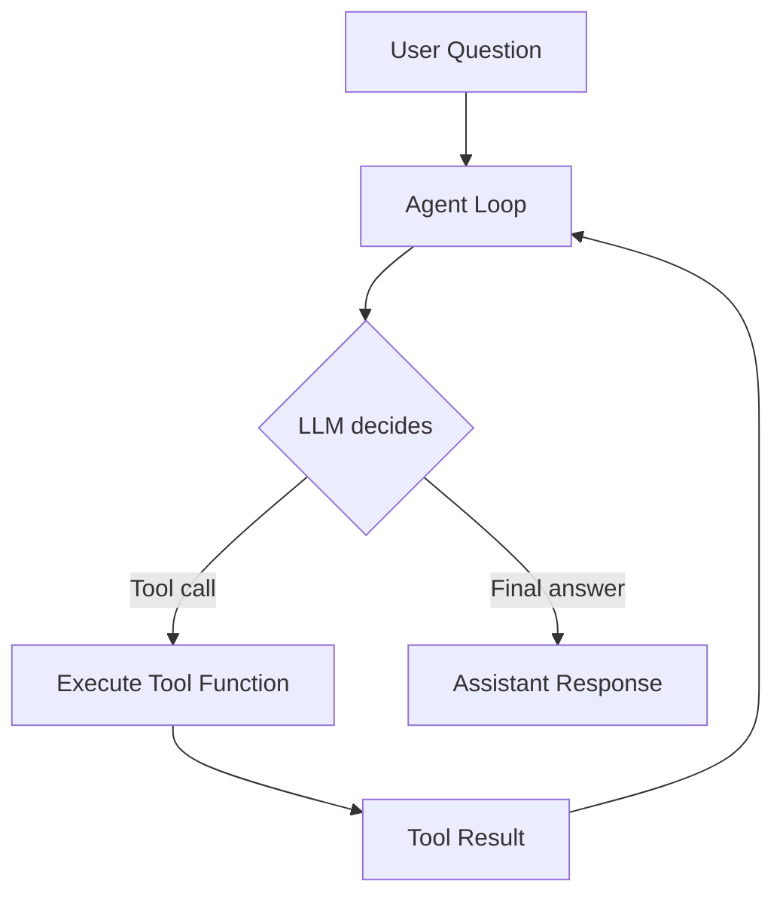
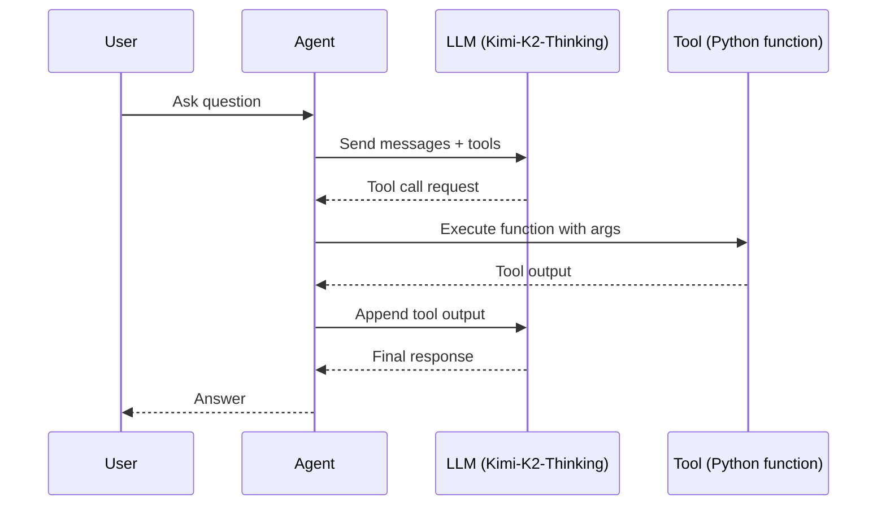

# Agents From Scratch

Build a minimal autonomous agent loop with tool-calling using the Moonshot AI Kimi-K2-Thinking model via Hugging Face Inference. This folder contains a notebook that walks through setup, tool schemas, and a custom `Agent` class.

[agents_from_scratch.ipynb](agents_from_scratch.ipynb)

Kaggle version: https://www.kaggle.com/code/huseyincenik/agents-from-scratch

## Used Technologies

## What the Notebook Covers

- Install and authenticate Hugging Face Inference
- Create a tool function (currency exchange)
- Define JSON schema for tool-calling (manual + Pydantic)
- Build a minimal `Agent` loop that executes tool calls
- Run an end-to-end demo

## Quick Start

1. Open the notebook: [agents_from_scratch.ipynb](agents_from_scratch.ipynb)
2. Install dependencies:
   - `huggingface_hub`
   - `pydantic`
3. Set your Hugging Face token when prompted.

## Architecture

## Notes

- The LLM is accessed via `InferenceClient` from `huggingface_hub`.
- Tool schemas are provided as JSON (manual) or generated with `pydantic`.
- The agent loop keeps calling the model until it returns a final message.

## Sources

- Hugging Face Hub tutorial: Agents from Scratch
- Intro to Agents (Alejandro AO)

